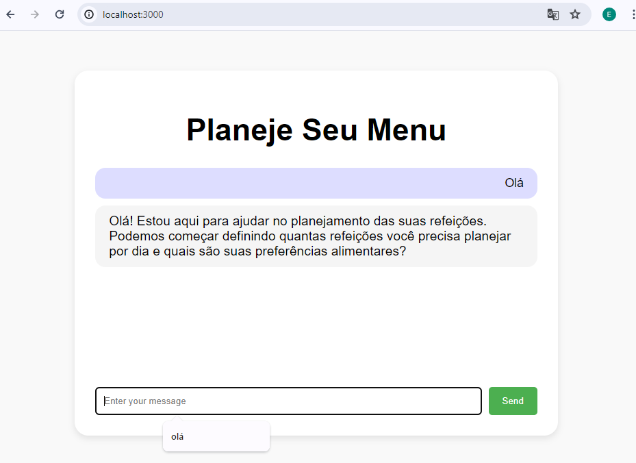
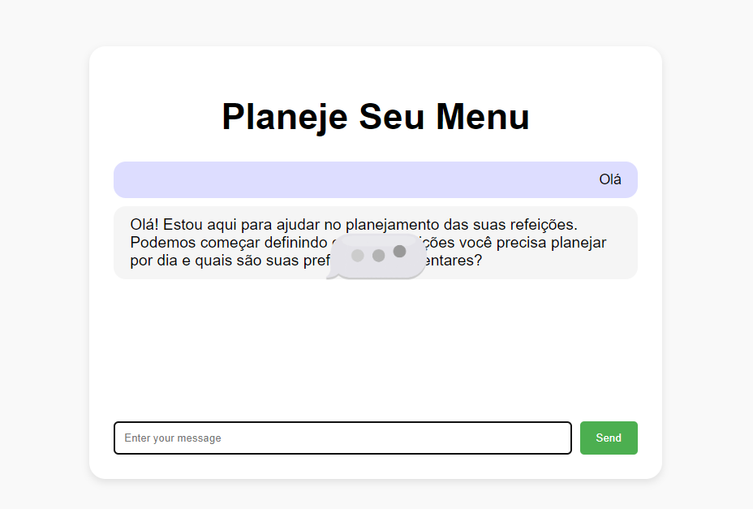

# Planeje Seu Menu

## Requisitos
1. `npm install`
2. Crie um arquivo `.env` e adicione sua chave de API como:
     ```
     API_KEY="Cole sua chave de API aqui"
     ```

### Requisitos de Software
- `node --version` # Deve ser >= 18

### Execução do Servidor
Para iniciar o servidor, execute o seguinte comando no terminal:  `node server.js`


- A porta de acesso no navegador é: `localhost:3000`


## Página do projeto

